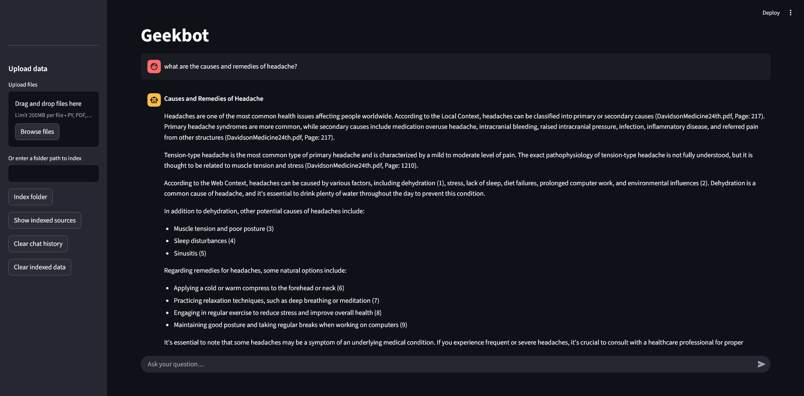

# Geekbot: Your Personal AI Document Assistant

This project is a powerful, locally-run AI chatbot designed to answer questions using your private documents. By running entirely on your laptop/desktop (16GB RAM or less, no GPU required!), it provides fast, secure, and private access to information from your own files.

This is my starting project dive into the world of LLMs(large language model) to learn about Retrieval-Augmented Generation (RAG), a key technique for building intelligent chatbots that use external data.

#### Features

<b>100% Local & Private:</b> All processing happens on your machine. Your data and conversations are never sent to a cloud server.

<b>Document Q&A:</b> Ask questions about your own PDFs, research papers, project notes, or any other supported file.

<b>Web Augmentation:</b> Optionally perform a live web search on DuckDuckGO to get the latest, most up-to-date information, complementing your local data.

<b>Multi-Modal RAG:</b> Supports various document types including .pdf, .txt, .md, .csv, and more.

<b>Friendly UI:</b> An intuitive web interface built with Streamlit makes it easy to chat and manage your documents.

<b>Efficient:</b> Built to run on a laptop without a dedicated GPU, using quantized models and a highly efficient pipeline.

#### Use Case: Med-Assist AI

While this project is designed for general use, its architecture is perfect for building a specialized tool like a Medical Assistant AI. By indexing medical textbooks, research papers, and clinical guidelines, you can create a secure, private chatbot that provides instant answers for healthcare professionals or students.

#### Getting Started

Follow these steps to set up and run the project on your machine.
#### Step 1: Install Ollama

First, download and install Ollama, the platform that runs the language models locally.
[Download Ollama from here](https://ollama.com/download)
#### Step 2: Download the Models

Open your terminal or command prompt and pull the necessary models. 
These are small enough to run on your laptop.

Download the model from the server

    ollama pull qwen3:0.6b
This is a lightweight model but you can also use other models below if your pc has a powerful GPU and more RAM because they require significant more processing power.
Here are some sample models you can use instead of the default one.
Download the model from ollama and switch the model name at <b>DEFAULT_MODEL</b> variable in rag_pipeline.py  
<b>gemma3:270m</b>  
This model is very light and sometimes loses context.  
<b>qwen3:0.6b </b>  
That can get the work done in low end PCs.  
<b>llama3.1:8b and deepseek-r1:1.5b</b>  
Models with more than 1.5b parameters which is good for reasoning  
<b>gpt-oss:20b</b>  
One of the heaviest models and latest released by OpenAI. It requires significantly more processing power with minimum 16GB ram and a powerful GPU.

Download the embedding Model (for document understanding)
    
    ollama pull nomic-embed-text

#### Step 3: Set up the Project

Clone this repository and install the Python dependencies.

#### Clone the repository
    git clone https://github.com/AbrarAdnan/Geekbot.git
    cd Geekbot

#### Create a virtual environment and install dependencies
Python 3.10 is recommended to use for this project
Initialize the virtualenv
    
    virtualenv venv
Activate the virtualenv
For linux
    
    source venv/bin/activate
For Windows 
    
    venv\Scripts\activate
Install the dependencies
    
    pip install -r requirements.txt

#### Step 4: Run the App

Make sure ollama app is running or run in in the terminal with
    
    ollama serve

Launch the Streamlit app to start chatting with your documents.

    streamlit run app.py

#### Step 5: Enter your files through the streamlit UI
It'll take some time to sync and will show you the progress after it's done

Your browser will automatically open a new tab with the chatbot UI.
### Improvements & Future Work

This project can be a solid foundation for more complex applications. Here are some potential improvements to consider for future development:

<b>Refined Citation:</b> Improve the citation format to be cleaner and more consistent.

<b>Advanced Web Search:</b> Implement an agentic web search, where the LLM decides if a search is needed and what to search for.

<b>Multi-modal Input:</b> Add support for image and audio input, allowing the user to upload a chart or a voice note and get answers.

<b>Model Fine-tuning:</b> Fine-tune a general-purpose LLM on specific domain data to improve its specialized knowledge and response quality.

<b>UI/UX Enhancements:</b> Add features like chat history saving, model selection within the UI, and a more polished design.

### Project Structure

<b>app.py:</b> The main Streamlit UI for the chatbot.

<b>rag_pipeline.py:</b> The core logic for RAG, including retrieval, multi-query expansion, and web search.

<b>storage_utils.py:</b> Contains shared helper functions for document processing and database management.

<b>get_embedding_function.py:</b> Defines the embedding model used for converting text into vectors.

<b>chroma/:</b> The directory where the vector database is stored.

<b>uploaded/:</b> The files uploaded for indexing will be stored here

Any suggestions for new fuatures and collaboration is welcomed.